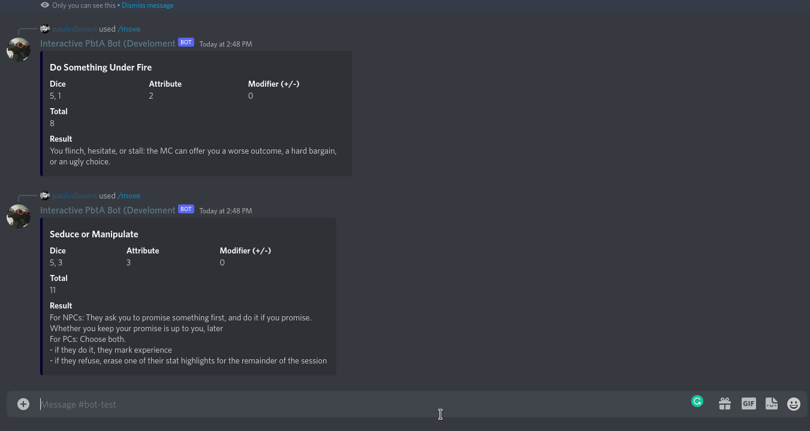

[][tests-action]
[][linters-action]

[tests-action]: https://github.com/paulodiovani/interactive-pbta-bot/actions/workflows/test.yml
[linters-action]: https://github.com/paulodiovani/interactive-pbta-bot/actions/workflows/linters.yml

# Interactive PbtA Bot 🤖

An Interactive Discord Bot for pbta games, using slash commands to trigger moves.

## Usage

- Install the bot into your Discord server from [one of the links below](#supported-games-languages-and-existing-bots), or
- [Deploy and create your own bot](#deploy-and-create-a-bot)

### Commands

The bot use slash commands available with `/move` (default command).

## Supported games, languages and existing bots
