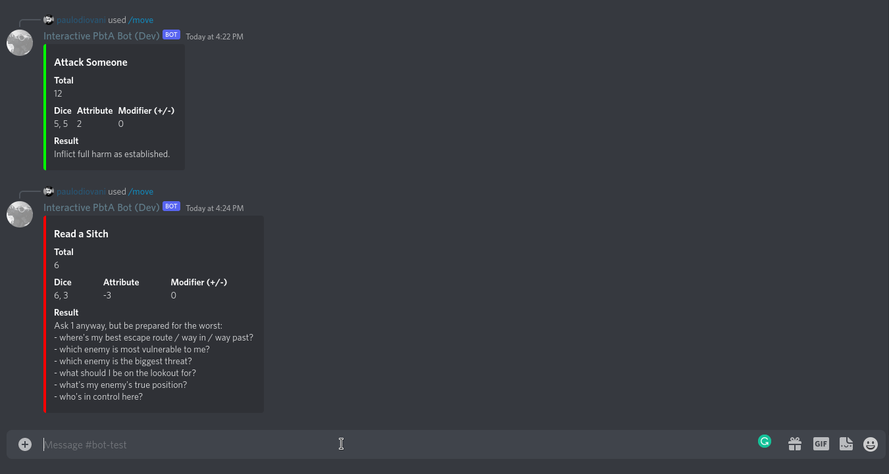

[][tests-action]
[][linters-action]

[tests-action]: https://github.com/paulodiovani/interactive-pbta-bot/actions/workflows/test.yml
[linters-action]: https://github.com/paulodiovani/interactive-pbta-bot/actions/workflows/linters.yml

# Interactive PbtA Bot 🤖

An Interactive Discord Bot for pbta games, using slash commands to trigger moves.

## Usage

- Install the bot into your Discord server from [one of the links below](#supported-games-languages-and-existing-bots), or
- [Deploy and create your own bot](#deploy-and-create-a-bot)

### Move commands

The bot use slash commands available with `/move` (default command).

You can also search for commands by typing any word matching the command name. Check the example below.

## Contributing

### Local development

1. Create a Discord App through https://discord.com/developers/applications
2. Click on **Bot** on the left panel and copy the **TOKEN** from your Bot
3. Copy `.env.sample` to `.env` and fill the `TOKEN`
4. Set the `MOVELIST` path to the YAML file with the moves and translations.
  + You can use one of the included in the `/moves` directory or create your own.
  + Check the [Add games or translations](#add-games-or-translations) section for more info.
5. (optional) Change other settings in `.env` according to your preferences.
6. `npm install` to install dependencies
7. `npm run dev` to run

### Add games or translations

TODO

## Deploy and create a bot

TODO

## Supported games, languages and existing bots

| Game                | Language  | Discord bots
| --                  | --        | --
| Apocalypse World    | en-US     |
|                     | pt-BR     |
